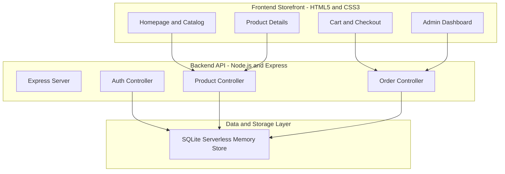
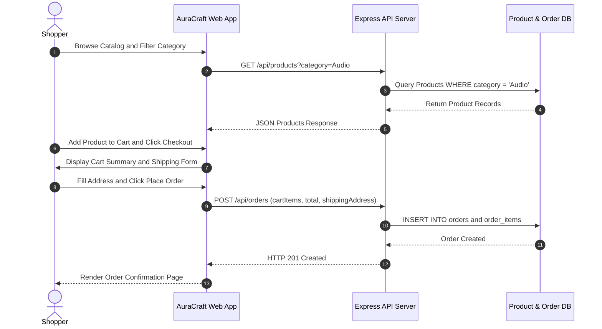

# AuraCraft - Premium E-Commerce Platform

> A full-stack, high-performance E-Commerce platform with dynamic product catalog, category filtering, cart management, checkout processing, order history, and admin dashboard.

[](https://ecommerce-app-ruby-rho.vercel.app)
[](https://github.com/Ramesh2200/ecommerce-app)
[](LICENSE)

---

## 🌟 Key Features

- 🛒 **Dynamic Product Catalog**: High-resolution Unsplash product image galleries, price badges, stock counters, ratings, and feature lists.
- 🔍 **Search & Category Filtering**: Real-time multi-criteria filtering by category (Audio, Wearables, Electronics, Home & Living, Accessories), price range, and search query.
- 💳 **Seamless Checkout & Cart**: LocalStorage cart persistence, order summary calculations, address collection, and simulated payment processing.
- 📦 **Order Management**: Order history log, status tracking (Processing, Completed), and order detail view.
- 🔐 **Authentication & Roles**: Customer and Admin login/registration with demo credential support.

---

## 🔑 Demo Account Credentials

| Attribute | Value |
|---|---|
| **Demo Email** | `codealpha123@gmail.com` |
| **Demo Password** | `Code123` |
| **Live App URL** | [https://ecommerce-app-ruby-rho.vercel.app](https://ecommerce-app-ruby-rho.vercel.app) |
| **Live API Endpoint** | [https://ecommerce-app-ruby-rho.vercel.app/api/products](https://ecommerce-app-ruby-rho.vercel.app/api/products) |

---

## 📐 Architecture & Workflow Diagrams

### System Architecture Diagram



### E-Commerce Purchase & Order Workflow



---

## 🛠️ Technology Stack

- **Frontend**: HTML5, Vanilla CSS3, JavaScript (ES6+), FontAwesome / Lucide Icons
- **Backend**: Node.js, Express.js, CORS, Body-Parser
- **Database**: SQLite3 / Node-SQLite / Serverless In-Memory Fallback
- **Deployment**: Vercel Serverless Functions & Static Asset CDN

---

## 💻 Local Development Guide

### 1. Clone Repository
```bash
git clone https://github.com/Ramesh2200/ecommerce-app.git
cd ecommerce-app
```

### 2. Install Dependencies
```bash
npm install
```

### 3. Seed Database & Start Server
```bash
npm run seed
npm start
```
- **Local Web Storefront**: `http://localhost:3030`
- **Health Check Endpoint**: `http://localhost:3030/api/health`
