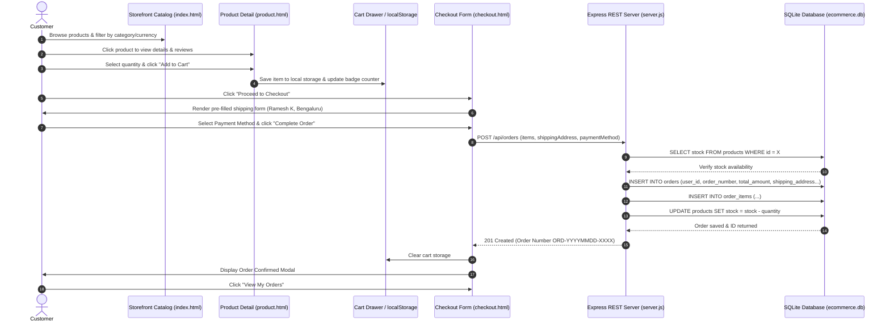
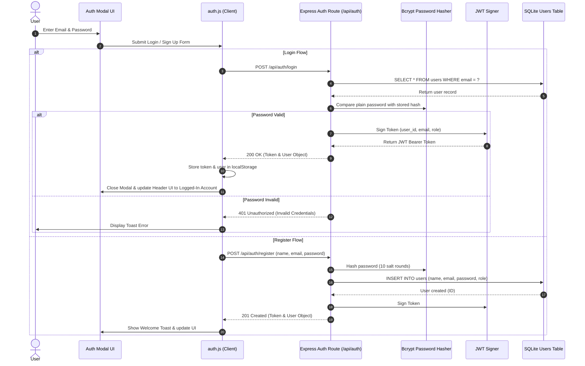
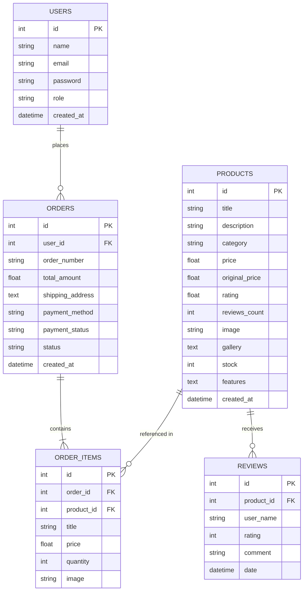
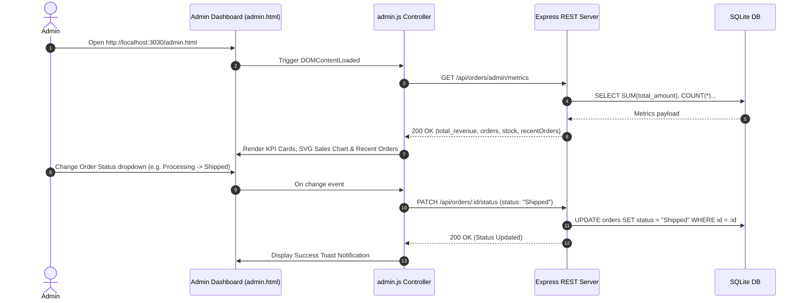

# AuraCraft E-Commerce System Architecture & Workflow Diagrams

This document outlines the end-to-end system architecture, data models, and user workflow diagrams for the **AuraCraft E-Commerce Application**.

---

## 1. 🏗️ High-Level System Architecture

```mermaid
graph TD
    Client[("🖥️ Web Browser / Client<br/>(HTML5, CSS3, Vanilla JS)")]
    
    subgraph Frontend Modules
        App[app.js - Product Catalog]
        Detail[product-detail.js - Details & Reviews]
        Cart[cart.js - Cart & Drawer UI]
        Checkout[checkout.js - Checkout & Payment]
        Orders[orders.js - Order History]
        Admin[admin.js - Analytics & Management]
        Currency[currency.js - USD/INR Conversion]
    end

    subgraph Express Backend REST API
        AuthRoutes["/api/auth (Auth Controller)"]
        ProductRoutes["/api/products (Product Controller)"]
        OrderRoutes["/api/orders (Order Controller)"]
    end

    subgraph Database Layer
        DB[("SQLite3 Database<br/>ecommerce.db")]
        UsersTable[users Table]
        ProductsTable[products Table]
        ReviewsTable[reviews Table]
        OrdersTable[orders Table]
        ItemsTable[order_items Table]
    end

    Client --> Frontend Modules
    Frontend Modules -->|Fetch / REST API| Express Backend REST API
    Express Backend REST API --> DB
    DB --> UsersTable
    DB --> ProductsTable
    DB --> ReviewsTable
    DB --> OrdersTable
    DB --> ItemsTable
```

---

## 2. 🔄 End-to-End User Purchase & Order Processing Flow



---

## 3. 🔑 User Authentication Flow (Register & Login)



---

## 4. 🗄️ Relational Database ER Diagram



---

## 5. ⚙️ Admin Dashboard & Order Status Management Flow


